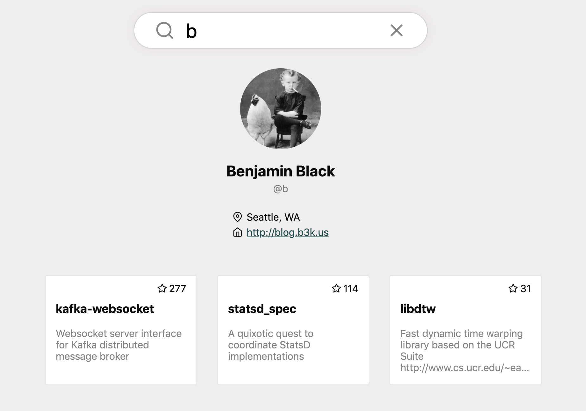

# 🕵️‍ &nbsp;github-users-explorer

### [github-users-explorer.netlify.com](https://github-users-explorer.netlify.com/)

<p align="center">
  
</p>

## 🛠 Development

### Build:

```sh
yarn build
```

### Start parcel devserver locally:

```sh
yarn start
```

### Test:

I'm using `jest` and `@testing-library/react` for unit tests.
You can run them with

```sh
yarn test
```
